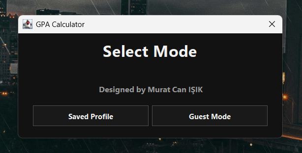
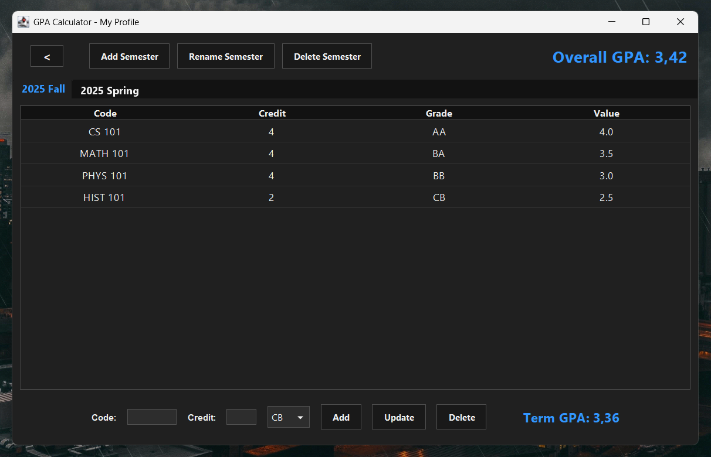
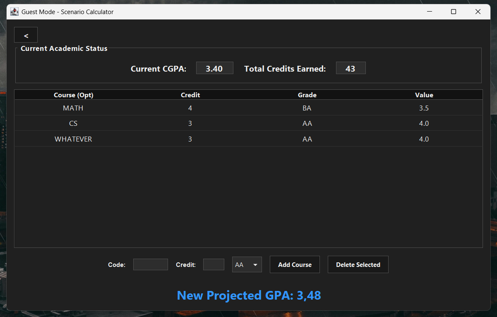

# GPA Calculator

> Developed by **Murat Can IŞIK**

This is a desktop application built with Java to help university students track their GPA and CGPA.

## How It Works

The application has two main modes depending on your needs:

* **Saved Profile:** This is for your actual academic record. You can create semesters and add courses. The program automatically saves your data to a local file, so you don't have to enter your grades again every time you open the app.
* **Guest Mode:** Use this for quick "what-if" scenarios. For example, if you want to see how your overall GPA changes based on a hypothetical grade, you can calculate it here without messing up your saved profile.

## Screenshots

### 1. Main Menu


### 2. Saved Profile


### 3. Guest Mode


## How to Run

It uses standard Java Swing, so no external libraries are required.

**Just download the `.jar` file from the *Releases* section if you don't want to compile it yourself.**

How to compile it yourself:

1.  **Download the code:**
    ```bash
    git clone https://github.com/cmuratt/GPACalculator.git
    ```
2.  **Compile:**
    ```bash
    javac *.java
    ```
3.  **Run:**
    ```bash
    java GPACalculatorGUI
    ```
